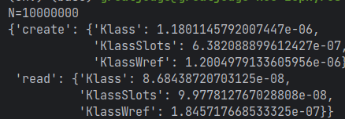
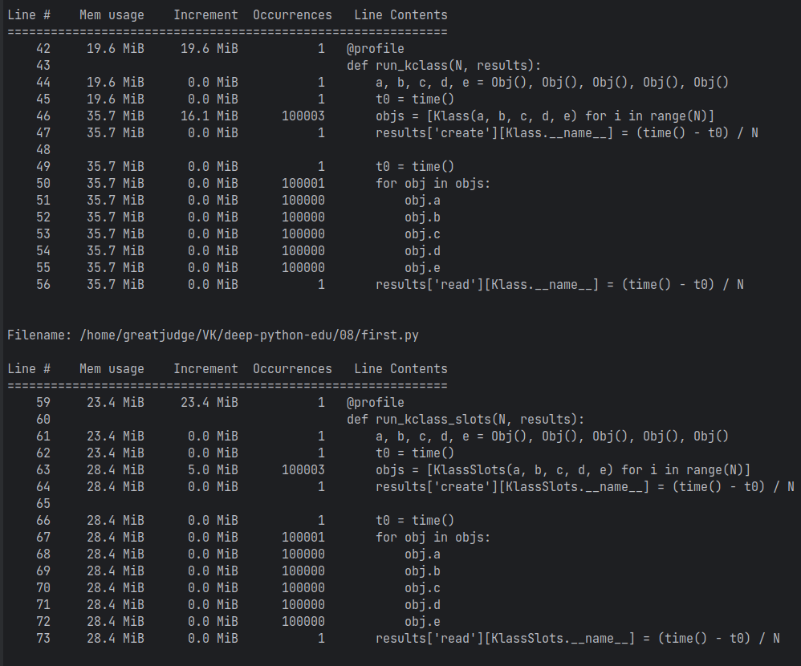
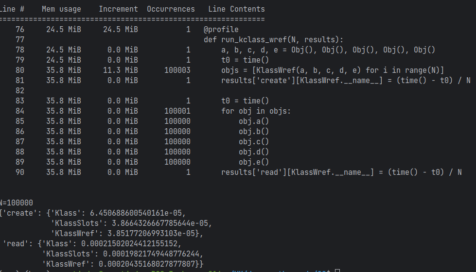
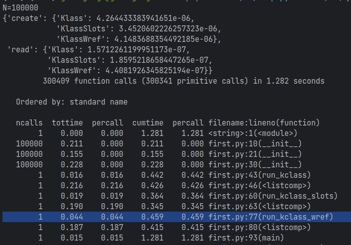

### 1. Сравнение использования weakref и слотов
  
Создание экземпляров Класса со слотами оказалось наиболее быстрым. Различия между остальными небольшие.  
  Чтение атрибута у экземпляра наиболее быстро у класса со слотами.
  У класса со слабыми ссылками самое большое время чтения значения.

### 2. Профилирование

  
Экземпляры класса со слотами используют в несколько раз меньше памяти, чем экземпляры остальных классов.  
Экземпляры обычного класса занимают больше всего памяти.  

